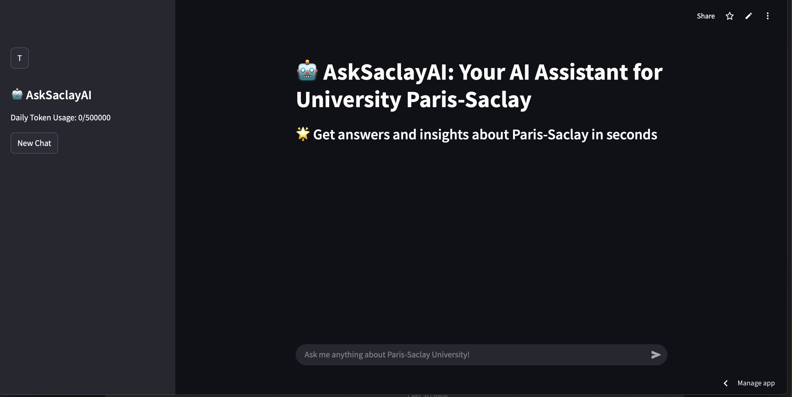
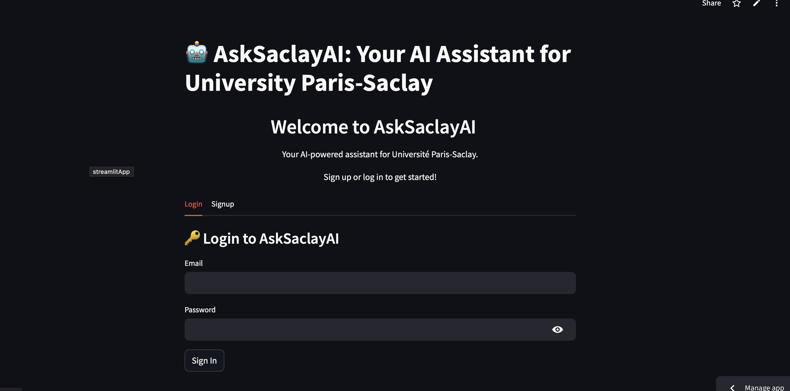

### 📌 **README.md**

```md
# 🤖 AskSaclayAI: Your AI Assistant for University Paris-Saclay

<!--    -->
 

🚀 Welcome to **AskSaclayAI**, an AI-powered chatbot designed to assist students, researchers, and staff at **University Paris-Saclay**. Whether you need academic information, campus details, or research assistance, AskSaclayAI is here to help!

---

## 🌟 Overview

**AskSaclayAI** is an intelligent chatbot designed to provide quick and accurate answers to questions about **University Paris-Saclay**. Whether you're a student, faculty member, or visitor, AskSaclayAI can help you find information about courses, research areas, events, and more. The chatbot is powered by **LangChain**, **Groq API**, and **OpenAI embeddings**, and it integrates with **Firebase** for user authentication and chat history storage.

---

## 🚀 Key Features

- **Multi-Language Support**: Answers questions in the same language as the query (e.g., French, English, Spanish).
- **PDF Document Retrieval**: Extracts information from uploaded PDF documents using **FAISS** for efficient similarity search.
- **Web Scraping**: Fetches real-time information from the [Université Paris-Saclay website](https://www.universite-paris-saclay.fr).
- **Wikipedia Integration**: Provides additional context using Wikipedia.
- **DuckDuckGo Search**: Performs web searches for up-to-date information.
- **User Authentication**: Secure sign-up and login using **Firebase Authentication**.
- **Chat History**: Saves and retrieves chat history for logged-in users.
- **AI Chatbot** – Get instant responses using **LangChain & OpenAI**  
- **Document Search** – Retrieve information from PDFs, Google, Websites, Wikipedia, ArXiv, and more  
- **Video Transcription** – Extract text from YouTube videos 
- **Multi-Source Search** – Integrated with **Google Search, DuckDuckGo, Wikipedia**  
- **Database Support** – Supports **ChromaDB, FAISS, FIREBASE, MySQL, SQLite**  
- **Beautiful UI** – Built with **Streamlit** for an intuitive experience  
- **Feedback System**: Users can provide feedback (👍 Like / 👎 Dislike) on responses.

---

## 🛠️ Tech Stack

- **Backend**: Python, Streamlit, LangChain, Groq API, OpenAI Embeddings
- **Database**: Firebase Firestore (for user data and chat history)
- **Authentication**: Firebase Authentication
- **Vector Storage**: FAISS (for efficient document retrieval)
- **Web Scraping**: BeautifulSoup (via LangChain's WebBaseLoader)
- **Environment Management**: `.env` file for sensitive configurations

---

## 🚀 Getting Started

### Prerequisites

- Python 3.10 or higher
- A Firebase project with Firestore and Authentication enabled
- API keys for:
  - Groq API
  - OpenAI
  - Firebase

## 🛠️ Installation

### 1️⃣ Clone the Repository
```bash
git clone https://github.com/kempsly/AskSaclay_bot.git
cd AskSaclay_bot
```

### 2️⃣ Install Dependencies
```bash
pip install -r requirements.txt
```

### 3️⃣ Set Up Environment Variables  
   - Create a `.env` file in the root directory and add the following:
     ```plaintext
     GROQ_API_KEY=your_groq_api_key
     OPENAI_API_KEY=your_openai_api_key
     FIREBASE_API_KEY=your_firebase_api_key
     FIREBASE_AUTH_DOMAIN=your_firebase_auth_domain
     FIREBASE_PROJECT_ID=your_firebase_project_id
     FIREBASE_STORAGE_BUCKET=your_firebase_storage_bucket
     FIREBASE_MESSAGING_SENDER_ID=your_firebase_messaging_sender_id
     FIREBASE_APP_ID=your_firebase_app_id
     FIREBASE_MEASUREMENT_ID=your_firebase_measurement_id
     FIREBASE_CREDENTIALS_JSON=your_firebase_credentials_json
     ```

4. **Install Dependencies**:
   ```bash
   pip install -r requirements.txt
   ```

5. **Add PDF Documents**:
   - Place your PDF files in the `pdf_data/` directory. These documents will be used for retrieval-based question answering.

6. **Run the App**:
   ```bash
   streamlit run app_bot.py
   ```

---

## 📂 **Project Structure**

```
📂 AskSaclayAI
│── 📜 app_bot.py          # Main Streamlit application
│── 📜 auth.py             # Authentication logic (Firebase)
│── 📜 firebase_config.py  # Firebase setup
│── 📜 bot.py              # AI chatbot logic
│── 📜 requirements.txt     # Project dependencies
│── 📜 README.md           # Project documentation
|── 📜 .gitignore          # Specifies files to ignore in Git
│── 📂 assets              # Images & logos
└── 📂 pdf_data                # PDF/Document storage
```

---
---

## 🖥️ Usage

1. **Sign Up or Log In**:
   - Use the sidebar to create an account or log in with your credentials.

2. **Ask Questions**:
   - Type your question in the chat input box. For example:
     - "What are the research areas at Paris-Saclay?"
     - "Bonjour! Pouvez-vous me dire où se trouve le campus?"

3. **View Chat History**:
   - Your chat history is saved and can be accessed in future sessions.

4. **Provide Feedback**:
   - Use the 👍 Like or 👎 Dislike buttons to provide feedback on the chatbot's responses.

---

## 🖥️ **Screenshots**

🔹 **Login Screen**  
  


🔹 **Chat Interface**  
  

---

## 📝 Notes

- **Token Limits**: The chatbot has a daily token limit to manage API usage. If the limit is reached, users will be prompted to try again the next day.
- **FAISS Storage**: FAISS is used for in-memory vector storage, making it ideal for ephemeral environments like Streamlit Cloud.
- **Firebase Integration**: Firebase is used for secure user authentication and storing chat history.

---

## 🤝 Contributing

Contributions are welcome! If you'd like to contribute, please follow these steps:

1. Fork the repository.
2. Create a new branch for your feature or bugfix.
3. Commit your changes and push to the branch.
4. Submit a pull request.

---


## 📜 License

This project is licensed under the MIT License.

---

## 🙏 Acknowledgments

- **LangChain**: For providing the framework for building the chatbot.
- **Groq API**: For powering the LLM with high-performance inference.
- **OpenAI**: For embeddings and language model support.
- **Firebase**: For authentication and database services.

---

Made with ❤️ by [Kempsly].  
For questions or feedback, please reach out at [kempslysilencieux3@gmail.com].

💡 **Made with ❤️ for University Paris-Saclay!**  
🚀 **Have a question? Reach out!** 
```

--- 
